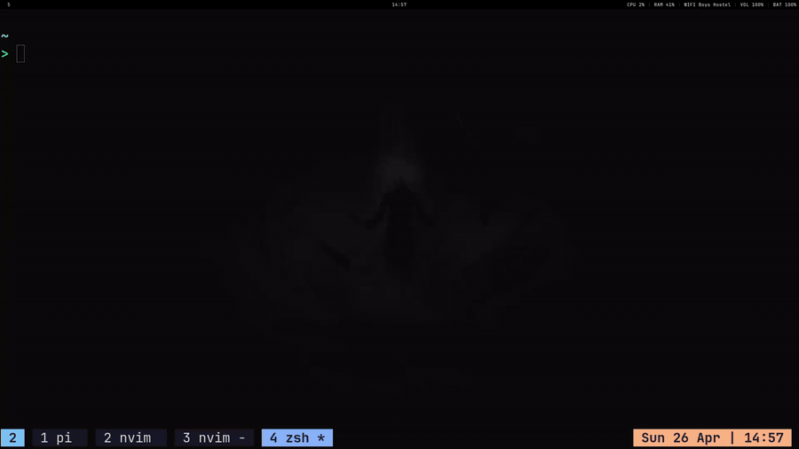

# ask

<p align="center"><b>AI agent for your terminal. Everything stays local.</b></p>
<p align="center">Written in Go. Runs everywhere. Full control over your data.</p>

<p align="center">
  <a href="./assets/demo-smooth.gif">
    
  </a>
  <br/>
  <sub>Click to see full demo</sub>
</p>

A no-nonsense CLI for talking to LLMs with actual superpowers. Chat in REPL mode or fire one-off questions. Optional agent mode lets the AI run shell commands, edit files, make HTTP calls, and manage local todos/memory—all with approval gates you control.

## Features

- **REPL chat** with slash commands for config on the fly
- **One-shot mode** for quick questions (pipes stdin too)
- **Streaming markdown** rendering as you type
- **Agent mode** with tool calling (shell, file ops, HTTP, clipboard, todos, memory)
- **Approval gates** per action (bypass with `--yolo` if you're in a hurry)
- **Chat history** persisted in SQLite
- **Vector memory** store for long-term context (add/view/update/delete)
- **Named lists/todos** stored locally (accessible to the agent)
- **Shell completions** for bash/zsh/fish
- **Custom system prompts** (load from file)

## Requirements

Go 1.25+ and a Gemini API key. Set it in your environment:

```bash
export GEMINI_API_KEY="your_key_here"
```

## Quick Start

```bash
git clone https://github.com/zephex/go-ask.git
cd go-ask
go build -o ask
./ask "Your question here"
```

Or install globally:

```bash
sudo mv ask /usr/local/bin/
```

## Usage

**One-shot mode:**

```bash
ask "What is a goroutine?"
ask --model exp "Analyze this architecture"
cat main.go | ask "Explain this code"
```

**Chat mode:**

```bash
ask --chat
# or
ask chat
```

**Agent mode (enable tool calling):**

```bash
ask --chat --agent
```

Auto-approve tool actions (use with caution):

```bash
ask --chat --agent --yolo
```

## Model Aliases

Quick names for common models:

- `free` – `gemma-4-26b-a4b-it` (default, fast)
- `cheap` – `gemini-3.1-flash-lite-preview` (ultra-light)
- `exp` – `gemini-3-flash-preview` (more capable)

Or pass any full model name.

## Reasoning Control

Dial up the thinking time (higher = slower, more accurate):

- `HIGH` – deep reasoning
- `MED` / `MEDIUM` / `MID`
- `LOW`
- `MIN` / `MINIMAL` – fast, lightweight

## Common Flags

```
--chat              Start REPL mode
--agent             Enable tool calling
--yolo              Auto-approve all actions
--stream            Stream markdown as it renders (default: on)
--system <file>     Load custom system prompt
--model <alias>     Pick a model
--reason <level>    Set reasoning level
--clear             Nuke chat history on startup
```

## Chat Mode (REPL)

Drop into an interactive session with slash commands for everything:

```bash
ask --chat
```

**Available commands:**

- `/help` – show this list
- `/status` – what model/settings are active
- `/model <name>` – switch models on the fly
- `/reason <level>` – adjust reasoning (HIGH/MED/LOW/MIN)
- `/stream on|off` – toggle streaming output
- `/agent on|off` – enable/disable tool calling
- `/yolo on|off` – auto-approve tools
- `/pwd` – print working directory
- `/cd <path>` – change directory for tool commands
- `/history [n]` – show last n messages
- `/clear` – wipe current conversation
- `/memories` – open the memory manager
- `/exit` or `/quit` – leave

## Memory (Vector Store)

Store facts locally and let the AI access them across chats. Useful for storing coding patterns, project context, or anything you want the agent to remember.

**Access:**

- CLI: `ask memories` (list), `ask memories manage` (interactive editor)
- Agent tools: `memory_view`, `memory_add`, `memory_update`, `memory_delete`

**Manager commands:**

- `l` / `list` – show all
- `d <n>` / `del <n>` – delete entry n
- `da` / `delall` – nuke everything
- `q` / `quit` – exit manager

### How It Works

**Storage:** Chromem persistent DB in `~/db`. Each memory gets a stable hash-based ID.

**Management:** Explicit (for now). Memories don't auto-inject into every prompt. You manage them via CLI or the agent tools. Automatic extraction/saving is disabled by design—keep it simple.

**Architecture:**

- Memories live in a local vector DB under `~/db`
- Each entry has a stable `id` (content hash) and `content`
- Retrieval code exists but isn't wired into agent prompts yet
- Automatic per-turn saving is commented out (can be enabled if needed)

**Status:** Memory is read/write explicit only. No automatic context injection yet. Call memory tools in the agent to use them.

## Agent Tools

Enable with `--agent`. The AI can call these tools automatically (with approval, unless `--yolo`):

**`run_shell_command`** – Execute bash

- Runs in your selected directory
- Returns stdout, stderr, exit code, timing
- **Approval required** (unless `--yolo`)

**`read_file`** – Read file contents

- Supports `start_line` / `end_line` for partial reads
- No approval needed (read-only)

**`write_file`** – Edit files

- Exact string replacement (`old_str` → `new_str`)
- Shows diff preview before confirming
- **Approval required** (unless `--yolo`)

**`clipboard`** – Read/write system clipboard

- Read: no approval
- Write: **approval required** (unless `--yolo`)

**`lists`** – Manage todos/lists

- Actions: `create_list`, `delete_list`, `get_lists`, `add_item`, `update_item`, `delete_item`, `get_items`
- Deletions need approval (unless `--yolo`)

**`http_request`** – Make HTTP calls

- Verbs: `GET`, `POST`, `PUT`, `PATCH`, `DELETE`
- GET: no approval
- Write ops (POST/PUT/PATCH/DELETE): **approval required** (unless `--yolo`)

**`mail`** – Manage AgentMail inbox threads and messages

- Actions: `get_threads`, `get_thread`, `send_email`, `reply_to_message`, `forward_message`, `delete_thread`
- Requires `AGENT_MAIL_API_KEY` and `INBOX_NAME` environment variables
- Send/reply/forward/delete: **approval required** (unless `--yolo`)

**`memory_view`** – List stored memories

- No approval needed

**`memory_add`** – Store a new memory

- No approval needed

**`memory_update`** – Update existing memory

- No approval needed

**`memory_delete`** – Delete memory entry

- No approval needed

## Telegram Integration

Run `ask` as a Telegram bot. Chat with the AI directly in Telegram with slash commands for config.

**Setup:**

1. Create a bot with BotFather on Telegram (get your token)
2. Set env var: `export TELEGRAM_BOT_TOKEN="your_token_here"`
3. Start the bot: `ask --background=true`

**Shared Context:** The Telegram bot uses the same SQLite database and vector memory as the CLI, so your chat history and memories persist seamlessly across both interfaces. Switch between Telegram and terminal—context is always there.

**Available commands:**

- `/start` – welcome message
- `/help` or `/about` – show commands
- `/model <name>` – switch AI model
- `/reasoning <level>` – adjust reasoning (HIGH/MEDIUM/LOW/MINIMAL)

Just send regular messages—they'll be processed by the AI and responses saved locally in SQLite. Perfect for keeping an AI assistant in your pocket.

## Shell Completions

Generate completions for your shell:

```bash
ask completion bash
ask completion zsh
ask completion fish
```

## Data Persistence

- **Chat history & lists (SQLite):** `~/.ask-go.db`
- **Vector memory (chromem):** `~/db/`

Everything stays on your machine.

## Important Notes

- **`--yolo` is dangerous.** Auto-approves shell commands, file writes, and HTTP requests. Only use in controlled environments or when you fully trust the AI's behavior.
- **Chat data is local.** Your conversations aren't sent anywhere except to the model provider (Gemini API).
- **No telemetry.** This is just Go + SQLite + local vectors.

## License

MIT (see `LICENSE`)
